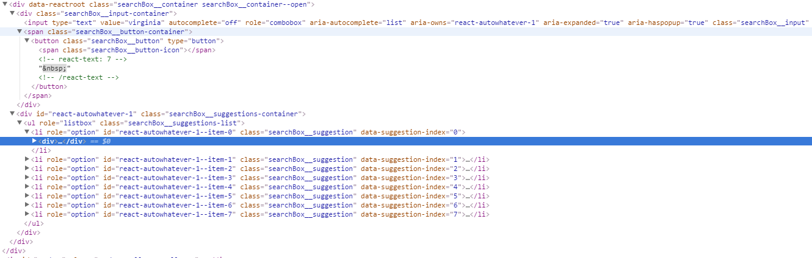
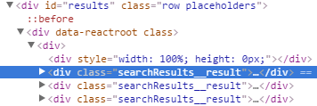
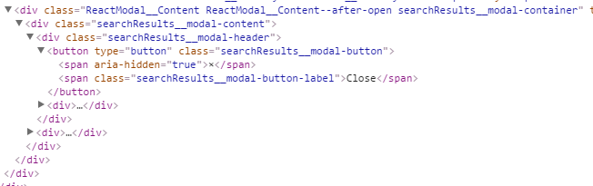
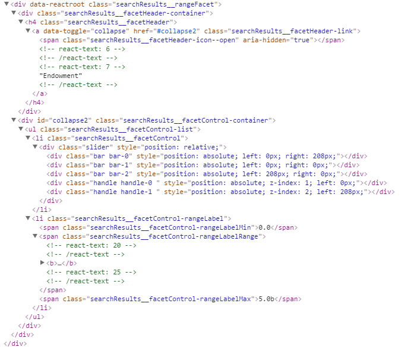
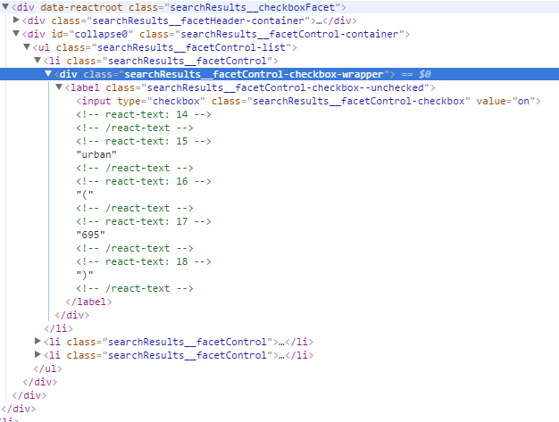

#AzSearch.js

A library to build search UI for Azure Search. It provides ready to go controls for searching with autocomplete, rendering results, and faceting. Customizable via mustache templates and configurable CSS classes. Query logic is abstracted away, no code required, simply provide configuration.

##Getting Started
1. Clone the repo
2. Install dependencies 
   ``` 
   npm install 
   ```
3. (optional) Install a web server to run the demo. I use http-server:
   ```
   npm install -g http-server
   ```
4. Build the project:
    * One time:
    ```
    npm run build
    ```
    * Watchify: 
    ```
    npm run start
    ```
5. Launch http-server
   ```
   npm run start_server
   ```
6. Navigate to 127.0.0.1:8080/examples/realestate.html

##Usage
###Basic configuration
AzSearch.js is built into a single script that can be included in an html file. First thing is to instantiate an instance of AzSearch with a few parameters that allow communication with your service.

```html
<script src="../bundle.js" type="text/javascript"></script>
<script>
    var search = new AzSearch({
        serviceName: "your-service-here",
        index: "your-index-here",
        queryKey: "xxxxxxxxxxxxxxxxxYourQueryKeyHerexxxxxxxxxxxxxxxxx"
    });
</script>
```
Configuration:
* `serviceName`: The name of your search service. This can be found in the azure portal. Can also be found in your service URL 'serviceName'.search.windows.net
* `index`: The name of the index that will be queried, currently AzSearch.js only supports a single index. Depending on how you're hosting the demo you may need to adjust CORS options on your index. If you're developing against a localhost, you'll need to set CORS to '*'.
* `queryKey`: Read only query key used to authenticate the client. Query key should always be used over API key in this scenario. Can also be found through the Azure Portal.

###SearchBox
Search Box is the component that gives you input box to enter basic queries and optionally autocomplete/suggestions. Basic usage as follows:

```html
<html>
    <body>
        <div id="searchBox">
        </div>
    </body>
</html>
<script src="../bundle.js" type="text/javascript"></script>
<script>
    var search = ...
    
    search.addSearchBox({
        htmlId:"searchBox",
    });
</script>
```
Configuration:
* `htmlId`: The id of the html element that you want the control to render in. This element shouldn't have any content.
* `suggesterName`: Optional. Specifies the suggester in the index that will be called for autocomplete/suggestions. Setting this parameter enables autocomplete on your SearchBox. 
* `hitHighlightPreTag`: Optional. Opening tag to be inserted before the matched suggestions text. Usually an html tag such as `<b>`.
* `hitHighlightPostTag`: Optional. Closing tag to be inserted after the matched suggestions text.
* `suggestionsTemplate`: Optional. [Mustache](https://mustache.github.io/) template to render the suggestions. Each suggestion will be bound to an instance of the template, properties returned by the [suggestions api](https://msdn.microsoft.com/en-us/library/azure/dn798936.aspx) will be available. A notable exception is `@search.text` which is renamed as `searchText` to be accessible within the template. The following example would render the returned searchText field as raw html, this can be useful if you're setting a highlighting tag such as `<b>`:
```js
suggestionTemplate: "{{{searchText}}}",
```
* `cssClasses`: Optional. Allows you to customize the css classes used by elements such as the input and button elements. See section 'Customizing CSS' at the end for a full list of customizable classes as well as diagrams of element hierarchy. Example that uses some common bootstrap classes:
```js
cssClasses: {
    searchBox__input: 'searchBox__input form-control',
    searchBox__inputContainer: 'searchBox__input-container input-group',
    searchBox__buttonContainer: 'input-group-btn',
    searchBox__button: 'btn btn-default',
    searchBox__buttonIcon: 'glyphicon glyphicon-search'
};
```
* `searchParameters`: Optional parameters to customize search api calls. See [search docs](https://msdn.microsoft.com/en-us/library/azure/dn798927.aspx) for details on these parameters.
    * `select`: Same as $select within the suggestions API. A list of comma-separated fields to retrieve. Default returns all retrievable fields. 
    * `scoringProfile`: The name of a scoring profile to evaluate match scores for matching documents in order to sort the results
    * `top`: Same as $top. Specifies the number of results to retrieve in each batch.
    * `searchFields`: List of comma-separated field names to scope your query to. Default will execute query over all searchable fields.
```js
searchParameters: {
        select: ["image_url", "title"],
        scoringProfile: "titleBoost",
        top: 50,
        searchFields: ["title"]
};
```

###ResultsView
Renders a results view that uses the window as a container for infinite scrolling. As you scroll more elements will be loaded. Basic usage is as follows:
```html
<html>
    <body>
        <div id="results">
        </div>
    </body>
</html>
<script src="../bundle.js" type="text/javascript"></script>
<script>
    var search = ...
    search.addResultsView({
        htmlId: "results",
    });
</script>
```

Configuration:
* `htmlId`: The id of the html element that you want the control to render in. This element shouldn't have any content.
* `resultTemplate`: Optional. [Mustache](https://mustache.github.io/) template to render the result. All index values returned by the query will be available for binding to the template. Defaults to a stringified representation of the returned JSON.
``` js
resultTemplate: 
        '' +
        '<h4 class="resultLabel">{{number}} {{street}} {{city}}, {{region}} {{countryCode}}</h4>' +
        '</img>'
```
* `modalTemplate`: Optional. [Mustache](https://mustache.github.io/) template that will render as a modal when the result is clicked. Used to give a more detailed view.
```js
modalTemplate: 
    `{{#description}}
        <tr>
            <th class="row-header">description</th>
            <td>{{description}}</td>
        </tr>
    {{/description}}
    {{#sqft}}
        <tr>
            <th class="row-header">sqft</th>
            <td>{{sqft}}</td>
        </tr>
    {{/sqft}}
    {{#status}}
        <tr>
            <th class="row-header">status</th>
            <td>{{status}}</td>
        </tr>
    {{/status}}
    {{#price}}
        <tr>
            <th class="row-header">price</th>
            <td>{{price}}</td>
        </tr>
    {{/price}}
    {{#beds}}
        <tr>
            <th class="row-header">beds</th>
            <td>{{beds}}</td>
        </tr>
    {{/beds}}`
```
* `modalTitleTemplate`: Optional. [Mustache](https://mustache.github.io/) for the title of the modal. Defaults to empty.
* `cssClasses`: Optional. Allows you to customize the css classes used by elements such as the input and button elements. See section 'Customizing CSS' at the end for a full list of customizable classes as well as diagrams of element hierarchy. Example that uses some common bootstrap classes:
```js
cssClasses: {
    searchResults__result: 'searchResults__result col-xs-6 col-sm-3',
    searchResults__modalContainer: "modal-dialog",
    searchResults__modalContent: "modal-content",
    searchResults__modalHeader: "modal-header",
    searchResults__modalButton: "close",
    searchResults__modalButtonLabel: "sr-only"
};
```

###CheckboxFacet
Creates a control that gives a simple checkbox style faceting experience over the specified field. You can render multiple of these, for multiple fields. Example usage:
```html
<html>
    <body>
        <ul class="facetContainer">
            <li id="bedsFacet">
            </li>
            <li id="bathsFacet">
            </li>
        </ul>
    </body>
</html>
<script src="../bundle.js" type="text/javascript"></script>
<script>
    var search = ...

    search.addCheckboxFacet({
        htmlId: "bedsFacet",
        fieldName: "beds",
        displayName: "Beds",
        isNumeric: true,
    });
    
    search.addCheckboxFacet({
        htmlId: "bathsFacet",
        fieldName: "baths",
        displayName: "Baths",
        isNumeric: true,
    });
</script>
```
Configuration:
* `htmlId`: The id of the html element that you want the control to render in. This element shouldn't have any content.
* `fieldName`: Name of the field in the index to target. Field must be facetable and filterable. 
* `displayName`: Label you would like to display for this facet.
* `isNumeric`: Boolean that specifies whether this is a categorical text facet, or a numerical facet.
* `cssClasses`: Optional. Allows you to customize the css classes used by elements such as the input and button elements. See section 'Customizing CSS' at the end for a full list of customizable classes as well as diagrams of element hierarchy. Example that uses some common bootstrap classes:
```js
cssClasses: {
    searchFacets__checkboxFacet: "panel-body",
    searchFacets__rangeFacet: "panel-body",
    searchFacets__facetHeaderContainer: "panel-heading",
    searchFacets__facetHeader: "panel-title",
    searchFacets__facetHeaderIconCollapsed: "indicator glyphicon glyphicon glyphicon-triangle-right",
    searchFacets__facetHeaderIconOpen: "indicator glyphicon glyphicon glyphicon-triangle-bottom",
    searchFacets__facetControlContainer: "panel-collapse collapse in",
    searchFacets__facetControlList: "list-group",
    searchFacets__facetControl: "list-group-item",
    searchFacets__facetControlCheckboxWrapper: "checkbox",
    searchFacets__facetControlRangeLabel: "list-group-item center-block text-center",
}
```

###RangeFacet
Creates a control that gives a range style faceting experience over the specified field with a slider that allows the user to specify min and max value. You can render multiple of these, for multiple fields. Example usage:
```html
<html>
    <body>
        <ul class="facetContainer">
            <li id="bedsFacet">
            </li>
            <li id="bathsFacet">
            </li>
        </ul>
    </body>
</html>
<script src="../bundle.js" type="text/javascript"></script>
<script>
    var search = ...

    search.addRangeFacet({
        htmlId: "sqftFacet",
        fieldName: "sqft",
        displayName: "Square feet",
        min: 0,
        max: 20000,
    });
</script>
```
Configuration:
* `htmlId`: The id of the html element that you want the control to render in. This element shouldn't have any content.
* `fieldName`: Name of the field in the index to target. Field must be facetable and filterable and numeric. 
* `displayName`: Label you would like to display for this facet.
* `min`: Minimum value for the specified field.
* `max`: Maximum value for the specified field.
* `cssClasses`: Optional. Allows you to customize the css classes used by elements such as the input and button elements. See section 'Customizing CSS' at the end for a full list of customizable classes as well as diagrams of element hierarchy. See CheckboxFacet for example.

###Custom CSS Classes
Custom CSS classes are intended to allow full customization of styling within the UI. Full hierarchy of each component is described below. If you have a problem with customization, please file an [issue](https://github.com/EvanBoyle/AzSearch.js/issues/new).

SearchBox:

```js
DefaultCssClasses[Constants.SEARCHBOX] = {
    searchBox__container:            'searchBox__container',
    searchBox__containerOpen:        'searchBox__container--open',
    searchBox__input:                'searchBox__input',
    searchBox__suggestionsContainer: 'searchBox__suggestions-container',
    searchBox__suggestionsList:      'searchBox__suggestions-list',
    searchBox__suggestion:           'searchBox__suggestion',
    searchBox__suggestionFocused:    'searchBox__suggestion--focused',
    searchBox__sectionContainer:     'searchBox__section-container',
    searchBox__sectionTitle:         'searchBox__section-title',  
    searchBox__inputContainer:       'searchBox__input-container',
    searchBox__buttonContainer:      'searchBox__button-container',
    searchBox__button:               'searchBox__button',
    searchBox__buttonIcon:           'searchBox__button-icon'
};
```
The following image shows how the keys relate to the dom structure:



ResultsView:

```js
DefaultCssClasses[Constants.SEARCHRESULTS] = {
    searchResults__result: 'searchResults__result',
    searchResults__modalContainer: "searchResults__modal-container",
    searchResults__modalContent: "searchResults__modal-content",
    searchResults__modalHeader: "searchResults__modal-header",
    searchResults__modalButton: "searchResults__modal-button",
    searchResults__modalButtonLabel: "searchResults__modal-button-label"
};
```
The following images shows how the keys relate to the dom structure:

result:



modal:



Facets: 

The following CSS classes are used for both types of facets.

```js
DefaultCssClasses[Constants.SEARCHFACETS] = {
    searchFacets__rangeFacet: 'searchResults__rangeFacet',
    searchFacets__checkboxFacet: 'searchResults__checkboxFacet',
    searchFacets__facetHeaderContainer: 'searchResults__facetHeader-container',
    searchFacets__facetHeader: 'searchResults__facetHeader',
    searchFacets__facetHeaderLink: 'searchResults__facetHeader-link',
    searchFacets__facetHeaderIconCollapsed: 'searchResults__facetHeader-icon--collapsed',
    searchFacets__facetHeaderIconOpen: 'searchResults__facetHeader-icon--open',
    searchFacets__facetControlContainer: 'searchResults__facetControl-container',
    searchFacets__facetControlList: 'searchResults__facetControl-list',
    searchFacets__facetControl: 'searchResults__facetControl',
    searchFacets__facetControlCheckboxWrapper: 'searchResults__facetControl-checkbox-wrapper',
    searchFacets__facetControlCheckboxChecked: 'searchResults__facetControl-checkbox--checked',
    searchFacets__facetControlCheckboxCheckedHover: 'searchResults__facetControl-checkbox--checkedHover',
    searchFacets__facetControlCheckboxUnchecked: 'searchResults__facetControl-checkbox--unchecked',
    searchFacets__facetControlCheckboxUncheckedHover: 'searchResults__facetControl-checkbox--uncheckedHover',
    searchFacets__facetControlCheckbox: 'searchResults__facetControl-checkbox',
    searchFacets__facetControlRangeLabel: 'searchResults__facetControl-rangeLabel',
    searchFacets__facetControlRangeLabelMin: 'searchResults__facetControl-rangeLabelMin',
    searchFacets__facetControlRangeLabelMax: 'searchResults__facetControl-rangeLabelMax',
    searchFacets__facetControlRangeLabelRange: 'searchResults__facetControl-rangeLabelRange'
};
```

RangeFacet: 

The following image shows how the keys relate to the dom structure:



CheckboxFacet:

The following image shows how the keys relate to the dom structure:


